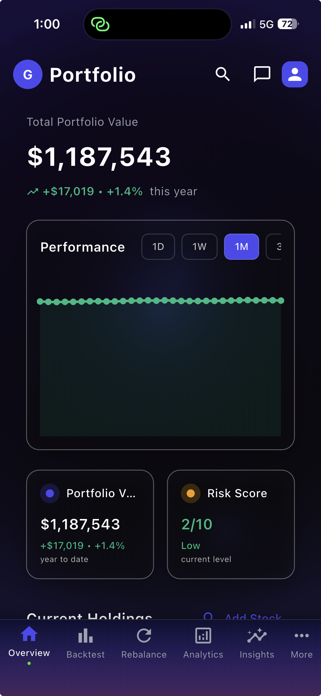
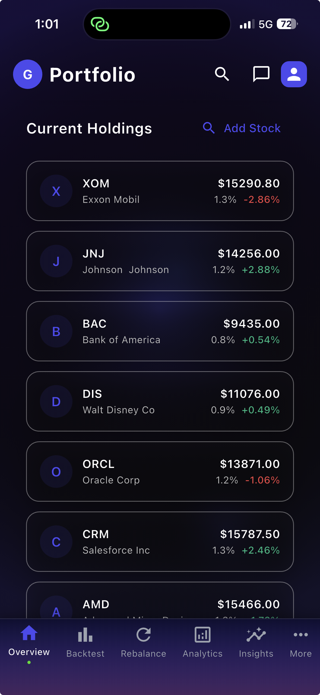
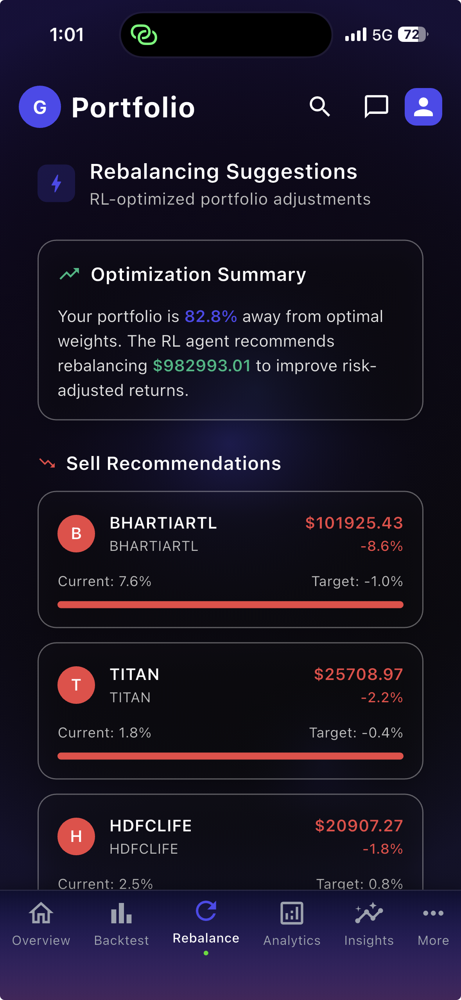
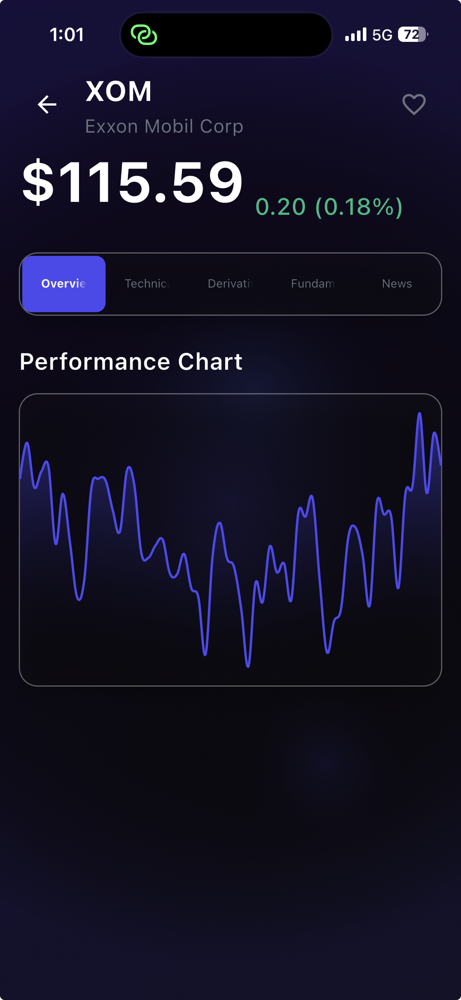
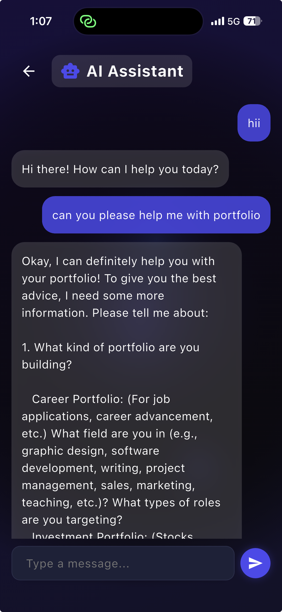
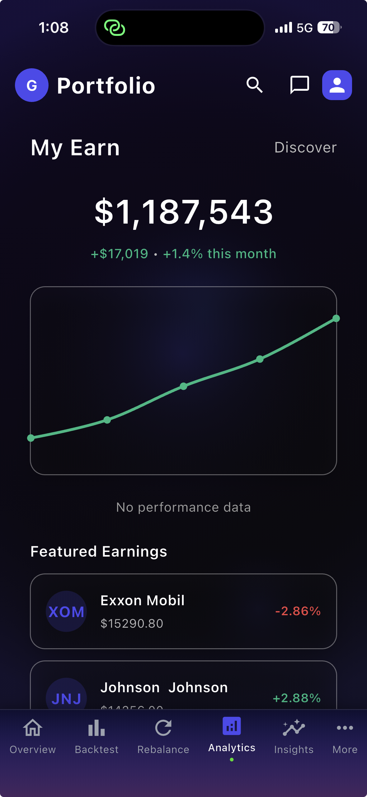
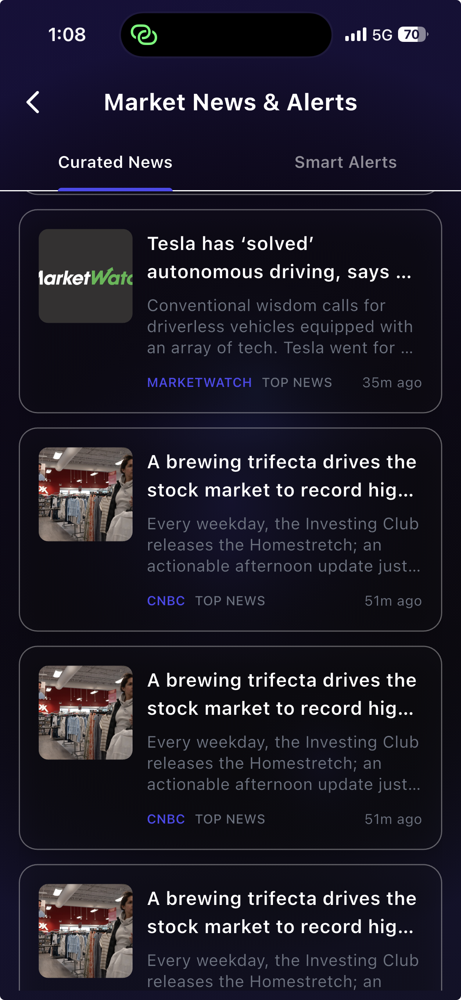

# OptiFolio: Portfolio Tracker

A full‑stack investment portfolio and analytics application. OptiFolio combines a Flutter mobile app, a Node.js + MongoDB backend, and a Python RL service for portfolio rebalancing.

> Drop your app screenshots into `Frontend/assets/images/` and they will render below. See “Adding Screenshots” for details.

---

## Contents
- Overview
- Screenshots
- Monorepo Structure
- Tech Stack
- Features
- Environment Variables
- Prerequisites
- Installation
  - Backend (Node.js)
  - Frontend (Flutter)
  - RL Model Service (Python)
- Running Full Stack
- API Overview
- Troubleshooting
- Deployment Notes
- Adding Screenshots
- Roadmap

---

## Overview
OptiFolio helps you track your investments, view analytics, and get AI‑powered insights. It supports onboarding/auth, portfolio CRUD, analytics, alerts, news, search, and an RL‑based rebalancer.

---

## Screenshots

<p align="center">
  
  
  
  
</p>

<p align="center">
  
  
  
</p>

---

## Monorepo Structure
```
OptiFolio/
├── Frontend/                 # Flutter app
│   ├── lib/
│   │   ├── widgets/
│   │   ├── providers/
│   │   └── services/
│   ├── pubspec.yaml
│   └── ios/ android/ assets/ ...
├── flutter-backend/          # Node.js API server
│   ├── src/
│   │   ├── app.js
│   │   ├── db.js
│   │   ├── middleware/
│   │   ├── controllers/
│   │   ├── routes/
│   │   └── models/
│   ├── package.json
│   └── .env
├── rl_rebalancer/            # RL model Python service
│   ├── api.py
│   ├── train.py
│   └── ...
└── docs/
    └── screenshots/          # Put README images here
```

---

## Tech Stack

### Frontend
- Flutter (Dart)
- Provider state management
- Custom theming, Google Fonts, animated overlays

### Backend
- Node.js, Express
- MongoDB (Mongoose)
- JWT auth
- CORS, Morgan

### RL Model
- Python
- Reinforcement learning for portfolio rebalancing

---

## Features

### Frontend
- Onboarding & Authentication
- Portfolio Dashboard, Analytics, Insights
- News Feed, Search, Stock Details, Quotes
- Rebalance Screen (suggestions + actions)
- Alerts management
- Dynamic Settings overlay (toggle/navigation/info cards)

### Backend
- Modular routes/controllers
- MongoDB models
- Health check endpoint `/api/health`

### RL Model
- Rebalancing via API
- Live inference endpoint

---

## Environment Variables

### Backend (`flutter-backend/.env`)
```
PORT=3000
MONGODB_URI="mongodb+srv://<user>:<password>@cluster0.mongodb.net/"
JWT_SECRET="your_jwt_secret"
GEMINI_API_KEY="your_gemini_api_key"
CORS_ORIGIN="*"
RL_API_URL="http://<rl_model_host>:8001"
```

### Frontend (`Frontend/.env`)
```
IOS_CLIENT_ID=<ios_client_id>
REVERSED_CLIENT_ID=<reversed_client_id>
WEB_CLIENT_ID=<web_client_id>
FINNHUB_API_KEY=<finnhub_api_key>
API_BASE_URL=http://<backend_host>:3000
```

---

## Prerequisites
- Node.js ≥ 18 and npm
- Python 3.11+ and pip (or conda)
- Flutter SDK 3.x
- Xcode (iOS) and/or Android Studio (Android)
- MongoDB Atlas cluster (or local MongoDB)

---

## Installation

### Backend (Node.js)
```bash
cd flutter-backend
npm install
npm run dev
```

### Frontend (Flutter)
```bash
cd Frontend
flutter pub get
flutter run -d ios
# or: flutter run -d android / chrome
```
If iOS pods are out of sync:
```bash
cd ios
pod repo update && pod install
```

### RL Model Service (Python)
```bash
cd rl_rebalancer
python -m venv venv
source venv/bin/activate  # on macOS/Linux
pip install -r requirements.txt
uvicorn api:app --host 0.0.0.0 --port 8001
```

---

## Running Full Stack
1. Start MongoDB (local or Atlas).
2. Start RL service: `uvicorn api:app --host 0.0.0.0 --port 8001`.
3. Start backend: `npm run dev` in `flutter-backend`.
4. Run Flutter app: `flutter run` in `Frontend`.

Health check:
```http
GET /api/health -> { "status": "ok" }
```

---

## API Overview

Base URL: `/api`

| Route Group   | Purpose                    |
|---------------|----------------------------|
| `/auth`       | Authentication             |
| `/portfolio`  | Portfolio CRUD / balances  |
| `/insights`   | Generated insights         |
| `/news`       | Market/news feeds          |
| `/rebalance`  | Rebalancing endpoints      |
| `/alerts`     | Price / event alerts       |
| `/search`     | Search results             |
| `/stocks`     | Stock data snapshot        |
| `/analytics`  | Performance & metrics      |
| `/quotes`     | Live/quote endpoints       |

Example:
```http
GET /api/portfolio
Authorization: Bearer <token>
```

---

## Troubleshooting
| Issue                       | Fix                                          |
|-----------------------------|----------------------------------------------|
| iOS pods out of sync        | `cd ios && pod repo update && pod install`   |
| CORS blocked                | Set `CORS_ORIGIN` correctly                  |
| Settings empty              | Ensure backend `/api/settings` + `loadSettings()` |
| Auth logout not redirecting | Ensure `/login` route registered in `MaterialApp` |

---

## Deployment Notes
- Do not commit `.env` files.
- Flutter prod builds: `flutter build ios` / `flutter build apk`.
- Backend: use reverse proxy (e.g., nginx) + HTTPS.
- Cache heavy analytics endpoints where possible.

---

## Adding Screenshots
You provided seven PNGs. Place them in `Frontend/assets/images/` with the same names so the gallery renders:
- `portfolio_screen.png`
- `portfolio.png`
- `rebalance_screen.png`
- `stock_screen.png`
- `chatbot.png`
- `analytics.png`
- `news.png`

If your files are elsewhere (e.g., Downloads), copy them into the path above and commit them. Images must be tracked in the repo for GitHub to show them.

---

## Roadmap
- Integration tests
- Web build pipeline
- Real-time price streaming (WebSockets)
- Offline caching layer
- Theming persistence

